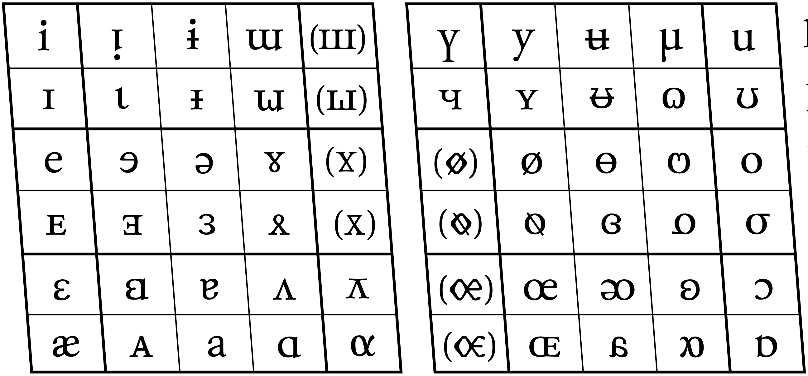

# Sophonetica

[](http://creativecommons.org/licenses/by-sa/4.0/)

This repo hosts _Sophonetica_, a font from [IdegenNyelvŐr](https://idegennyelvor.blog.hu/2011/04/10/betukeszlet_canipa_hoz), the first designed to write phonetics using Luciano Canepari's canIPA (http://www.canipa.net/doku.php).

_Sophonetica_ is licensed under the [Creative Commons Attribution-ShareAlike 4.0 International License][license].

## Usage on the web

This repo also allows you to easily embed _Sophonetica_ into your web content through a CDN. To use it, add the following code to the header of your HTML document:

```html
<link rel="stylesheet" href="https://cdn.jsdelivr.net/gh/giancarloantonucci/Sophonetica/font.css">
<style>
  canipa {
    font-family: Sophonetica, serif;
  }
</style>
```

## Optional shortcuts

Since _Sophonetica_ uses many Private Use Area (PUA) code points, I've included some character shortcuts. To use them, add the following code to the footer of your HTML document:

```html
<script type='text/javascript' src='https://cdn.jsdelivr.net/gh/giancarloantonucci/Sophonetica/render.js'></script>
```

This will enable the `render.js` script to replace the character shortcuts - within `<canipa></canipa>` - with the appropriate code points, allowing _Sophonetica_ to display correctly. For example, the characters

|   | 0 | 1 | 2 | 3 | 4 | 5 | 6 | 7 | 8 | 9 |
|:-:|:-:|:-:|:-:|:-:|:-:|:-:|:-:|:-:|:-:|:-:|
| A | i | ᴉ | ɨ | ɯ |   | ү | y | ʉ | µ | u |
| B | ɪ | ɩ | ᵻ | {ω} |   | ч | ʏ | ᵿ | ɷ | ʊ |
| C | e | ɘ | ə | ɤ |   |   | ø | ɵ | ო | o |
| D | ᴇ | ⱻ | ɜ | ᴥ |   |   | ᴓ | ɞ | {9} | σ |
| E | ɛ | ꞛ | ɐ | ʌ | {⊼} |   | œ | ᴔ | ʚ | ɔ |
| F | æ | ᴀ | a | ɑ | α |   | ɶ | {6} | {8} | ɒ |

will map to the full list of 52 vocoids:



> [!WARNING]  
> Characters within braces {} might change in future updates.
